# Lin_Timo_CSE 565_LoadTestingProject
## Task 1 — Identification of Framework
I chose **k6** as the load-testing framework for this project. **k6** is an open-source tool designed for testing the perofrmance and reliability of APIs and web services. It can generate large volumes of concurrent virtual users from a single command-line interface while remaining lightweight and scriptable. By writing test scripts in JavaScript, k6 allows the tester to define user behavior with precise control over concurrency, iteration rate, and runtime thresholds.

### Reference
- https://grafana.com/docs/k6/latest/
- https://grafana.com/docs/k6/latest/using-k6/http-requests/
- https://grafana.com/docs/k6/latest/using-k6/k6-options/
- https://grafana.com/docs/k6/latest/using-k6/thresholds/

## Task 2 — Test Case Design
### Flask Wrapper
Flask endpoint that runs `execute_tasks()` once per request:
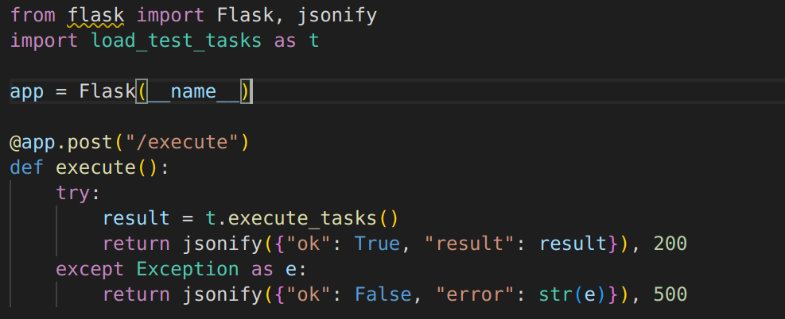
Run server with worker(s):

### k6 Script
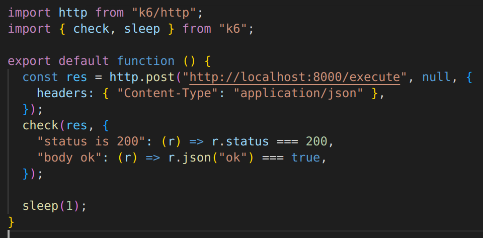
### Test Cases
Light load:

Medium load:

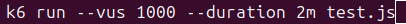

Larget load:

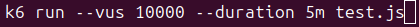

## Task 3 — Monitoring & Execution Report
### Metrics
- Requests per second (RPS): system throughput
- Response time (avg, median, p95, p99): user experience and tail latency
- Failures in real time: stability and error modes
### Light load with 100 users
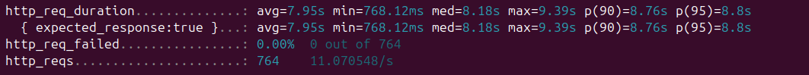
### Medium load with 1000 users
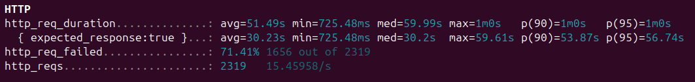
### Large load with 10000 users
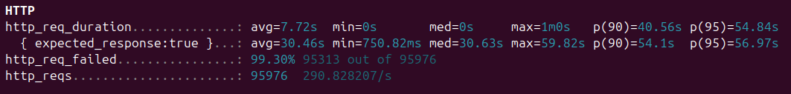

## Task 4 – Analysis

At **light load (100 users)**, the system was stable with no failures and consistent ≈ 8 s response times.
This suggests that the combined tasks—sorting data, simulated database wait, API call, file I/O, computation, and logging—ran within capacity across the four Gunicorn workers.

At **medium load (1 000 users)**, the average response time spiked to ≈ 51 s and more than 70 % of requests failed.
This indicates CPU and disk contention: the data-processing and computation functions are CPU-bound, while the file I/O task contends for disk throughput.
Additionally, many failures likely originated in the api_request() function, where the external service (jsonplaceholder.typicode.com) throttles requests when hit concurrently.

At **large load (10 000 users)**, nearly all requests failed (≈ 99 %).
The few that succeeded showed extremely long tail latencies (p95 ≈ 55 s).
This points to overall system saturation, which means process queues overflowed, threads starved for CPU time, and external HTTP connections began timing out.
In short, the bottlenecks lie in CPU-intensive operations and network I/O to the third-party API, both of which scale poorly under massive concurrency.

## Task 5 – Improvement of Test Strategy
After completing the baseline load tests in Task 2 and analyzing the results in Task 4, it was evident that the original testing approach, which was executing the combined workload through a single /execute endpoint, identified overall system degradation but did not clearly reveal which component caused the slowdown or failures. Therefore, the test strategy was improved to produce more detailed insights by isolating system components and applying targeted load conditions.

### Revised Strategy
The Flask wrapper was modified to expose three additional endpoints(`/cpu`, `/io`, and `/api`) each responsible for a specific type of operation.
- `/cpu` executes the data-processing and computation tasks to stress the CPU.
- `/io` performs file-write/read and logging operations to stress the disk.
- `/api` sends requests to the external API to isolate network and remote-service performance.
This isolation enables direct observation of how each subsystem behaves under increasing concurrency.

### Implement Result
1000 users, `/cpu`
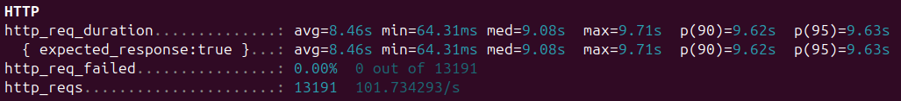

1000 users, `/io`
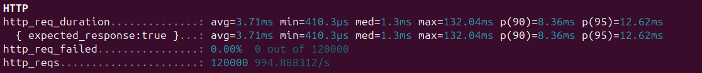

1000 users, `/api`
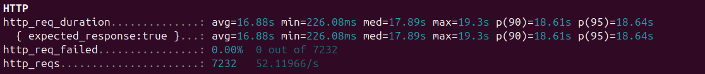

10000 users, `/cpu`
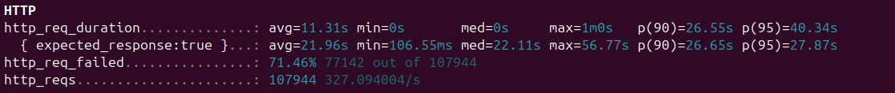

10000 users, `/io`
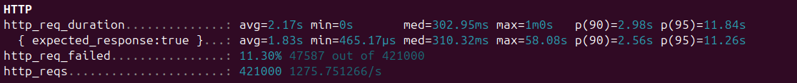

10000 users, `/api`
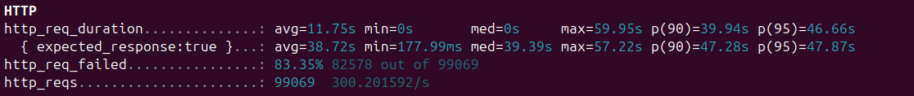

### Discussion
This refined strategy revealed three independent bottlenecks, which were CPU saturation, disk contention, and external API throttling, that were not clearly identifiable under the original all-in-one workload. By targeting each subsystem separately, it became possible to determine exactly when and where failures occur. The results demonstrate that CPU tasks scale poorly beyond several thousand concurrent requests, disk I/O quickly collapses under large parallel writes, and the external API cannot sustain heavy request volumes without rate limiting.

In conclusion, the improved strategy successfully identified additional performance bottlenecks by combining subsystem isolation with controlled arrival-rate testing. These refinements transformed a general scalability test into a diagnostic experiment that explains why performance degrades, not just that it does. The evidence supports future optimization recommendations such as parallelizing CPU operations, batching or caching file writes, and introducing retry and back-off logic for external API calls.