# CSE565-Software-Verif-Validation-Test

## Development of the algorithm
The algorithm implemented for this project was designed in Python and forms the basis for subsequent testing.

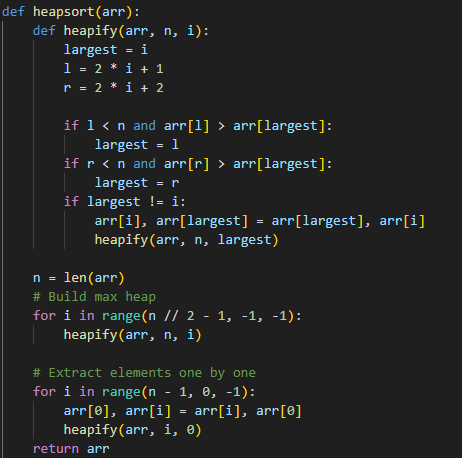

## Explanation of the unit testing framework and prompt generation
I chose `pytest` to be the testing framework since I used it during my internship and it is the testing framework I am familiar with the most

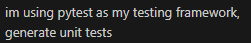

## Explanation of the test cases by AI tool
The AI-generated test cases covered both expected and boundary inputs. For instance, test cases included validation of correct outputs, exception handling, and edge conditions.

### `test_empty_list`
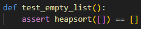
- Tests how the algorithm handles and edge case with no elements
- Sorting an empty list should return an empty list. This validates stability with degenerate input

### `test_single_element`
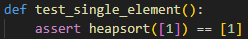
- Checks behavior on the minimal non-empty input
- Sorting a list with one element should return the same list. Ensures no unnecessary modifications

### `test_already_sorted`
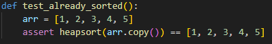
- Verifies correctness when input is already in ascending order
- Confirms that the algorithm doesn’t disrupt correctly sorted input

### `test_reverse_sorted`
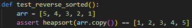
- Tests a “worst-case” ordering scenario
- Ensures that heapsort correctly handles descending input and produces a fully ascending output

### `test_duplicates`
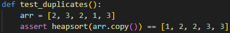
- Checks how the algorithm handles duplicate values
- Sorting should preserve all elements and order them correctly without dropping duplicates

### `test_negative_numbers`
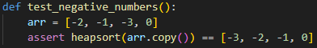
- Ensures proper handling of negative integers alongside zero
- Sorting should still work with values below zero

### `test_all_identical`
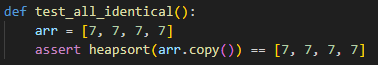
- Evaluates stability when all inputs are equal
- Sorting identical values should produce the same list

### `test_large_list`
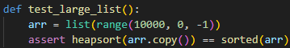
- Stress-test with 10,000 elements in reverse order
- Verifies algorithm efficiency and correctness on large datasets

### `test_mixed_types`
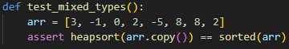
- Mix of positive, negative, and duplicate integers
- Confirms consistent behavior across diverse integer inputs

### `test_mixed_types_int_float`
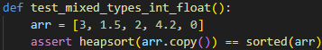
- Tests sorting with both integers and floats
- In Python, ints and floats are comparable → ensures heapsort works with mixed numeric types

### `test_float_values`
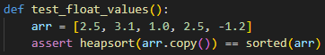
- Focused check on floating-point numbers (including negatives and duplicates)
- Ensures correct handling of decimal values

### `test_list_with_zero`
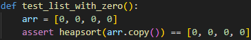
- Edge case where all elements are zero
- Sorting should preserve all identical zeros

### `test_list_with_large_negative_numbers`
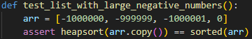
- Verifies algorithm’s ability to handle very large negative values
- Ensures robustness when inputs include extreme magnitudes

### `test_list_with_boolean`
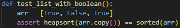
- Tests Python’s built-in handling of `bool` values (`False=0`, `True=1`)
- Confirms algorithm respects Python’s ordering rules for non-integers that behave like integers

### `test_list_with_strings`
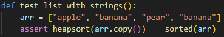
- Tests sorting with string inputs
- Ensures algorithm works with lexicographic ordering of text

## Report out of test case execution
The test suite was executed within a Python IDE using `pytest`. The results showed full execution of the test cases, with coverage metrics reported via `pytest-cov`.

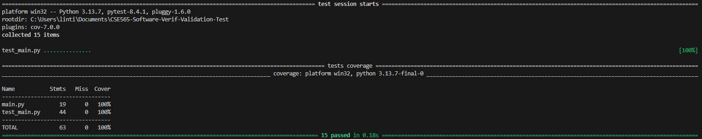

## Assessment and further improvement of test cases
The initial suite of AI-generated test cases demonstrated strong coverage across a wide variety of input conditions, including empty lists, single-element lists, pre-sorted, etc.
These tests collectively provided comprehensive coverage for valid input scenarios, as reflected in the high code coverage percentage (100%).

However, while the coverage was broad, the suite lacked explicit testing of invalid inputs, which are equally important in assessing the robustness of an algorithm.

To address this gap, an additional test case was introduced to evaluate the algorithm’s behavior when presented with mixed incomparable data types. Specifically, the test checked that attempting to sort a list containing both integers and strings (`[1, "a", 2]`) correctly raises a `TypeError`. This improvement ensured that the `heapsort` implementation does not silently fail or produce undefined behavior when confronted with improper input. The inclusion of this case aligned the algorithm’s behavior with Python’s built-in `sorted()` function, which also raises an error under such circumstances.

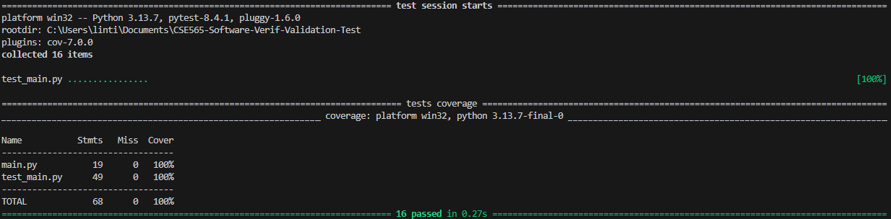

### `test_list_with_mixed_types`
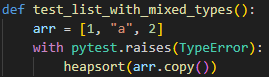
- Verifies that the algorithm raises an appropriate exception when given incomparable types (integers mixed with strings)
- In Python, comparing numbers (`int`) and strings (`str`) using relational operators (`<`, `>`) results in a `TypeError`. A well-designed sorting algorithm should not silently fail or produce undefined behavior in such cases—it should explicitly raise an error

## Assessment of the Generative AI Tool
The generative AI tool played a significant role in accelerating the creation of an initial set of unit tests. The tool demonstrated a strong ability to generate syntactically correct and functionally meaningful test cases that covered a broad spectrum of valid inputs, including edge conditions such as empty lists, reverse-sorted lists, duplicate elements, and mixed numeric data types. The generated suite provided high test coverage (100%) and significantly reduced the manual effort typically required in designing comprehensive unit tests from scratch.

Despite these strengths, certain limitations were observed. While the AI-generated tests thoroughly exercised correct input scenarios, they did not initially account for invalid or exceptional cases, such as attempting to sort lists containing incomparable data types. As a result, the responsibility for extending the suite to cover robustness and error-handling behaviors still rested with the developer. The subsequent addition of a student-authored test that validated the raising of a `TypeError` when sorting a list with mixed integers and strings highlighted this limitation.

Overall, the generative AI tool proved to be a valuable assistant rather than a replacement for human test design. It offered speed, diversity, and broad coverage but lacked the capacity for nuanced judgment and critical reasoning. When paired with human refinement, however, the tool meaningfully contributes to more efficient and thorough software verification processes.